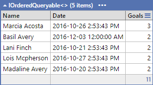
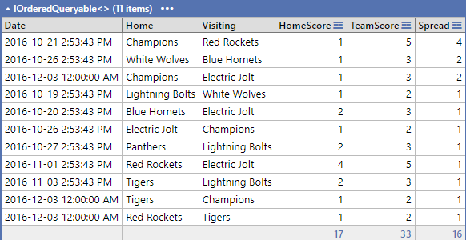
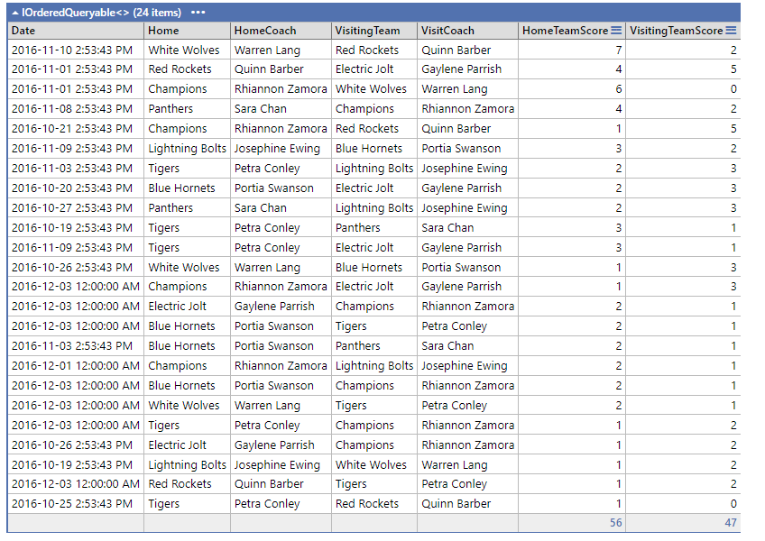
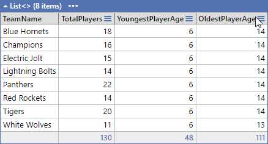
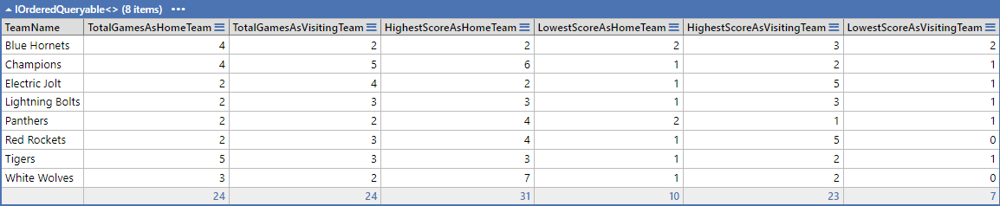
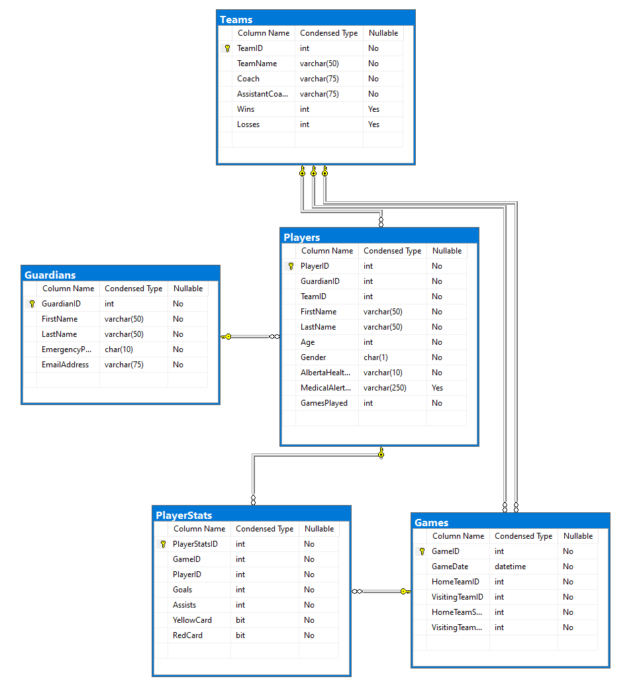

# In-Class Assessment - LINQ

**Your Name:** ______________________________ 

> Place your name in the lines above. Work on the lab computer, not your laptop or personal computer..

## Marking Summary

| Earned | Item Weight | Evaluation Item | Comments/Concerns |
| ------ | ----------- | --------------- | ----------------- |
|    | 2 | Question 1 |   |
|    | 2 | Question 2 |   |
|    | 2 | Question 3 |   |
|    | 2 | Question 4 |   |
|    | 2 | Question 5 |   |
|    | -3 max | Penalities (insufficent commits, file submission, etc.) |   |
| -- | ------ | ------------------------------------------------------- |   |
|    | 10 | Total |    |

### Marking Rubric

| Weight | Breakdown |
| ----   | --------- |
| **2** | 2 = Proficient (requirement is met) 1 = Limited (requirement is poorly met, minor errors) 0 = Incomplete (requirement not met, missing large portions) |

----

## Database

The physical database can be installed from the `.bak` file or the `.bacpac` file included in the starter kit.

## About FSIS

> **Fort Sasquatch Indoor Soccer** is a community soccer league.

## Queries

In this assessment you are required to implement simple Linq queries. Place each answer in a separate LinqPad Query. Your instructor will inform you on how and where to submit your files (one query per file). You **must** commit each question when you have completed it.

Your instructor will supplied the database so that you can test your answers. You will need to restore the back-up to your machine. The ERD of the database is attached to the end of this document.

You may have access to your computer, MS SQL and LinqPad. You may access to your notes and samples.

The supplied images for each question, indicate the needed data to be reported and what your results should look like.
 

**NOTE:  Any aggregate that return a "null" value MUST be shown as a "0"**

1. To understand player performance, retrieve the details of all players who have scored more than 1 goals in a single game. Ensure you showcase their full names, the game date, and the number of goals they scored in that particular game.  Order the results by goal  score (largest to smallest) then name 

2. The school wants a report on all the games where the home team lost. Return the home team name, visiting team name, and their respective scores. Order the results by spread desending and then by date. 

3. To celebrate the most exciting game of the season, you want to find the game with the highest combined score (sum of both teams' scores). Retrieve the game date, home team name, coach name, visiting team name, their coach name, their respective scores.  Order by **combined score** and home team score descending 

4. The league's analysts are keen on comparing team dynamics in terms of their player age structures. They wish to have an overview for each team that showcases the total number of players, the youngest player's age, and the oldest player's age.  Order by team name. 
5. As part of the season's wrap-up, the coaches are interested in understanding how their teams have performed in games. Specifically, they are interested in knowing, for each team, the total number of games played, the highest and lowest scores they achieved as a home team, as well as when they were the visiting team.. Order by the team name. 
   

