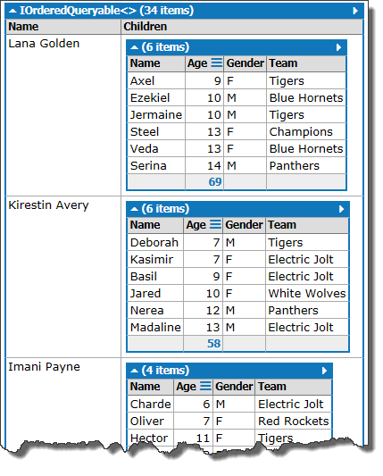
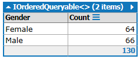
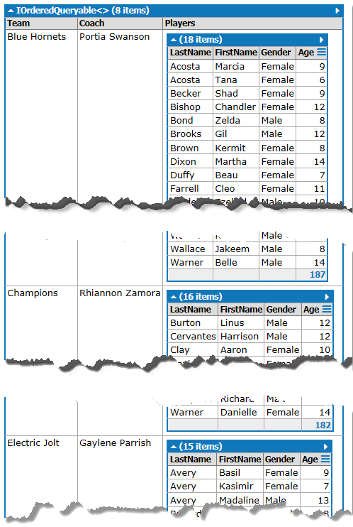
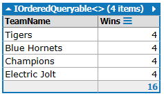
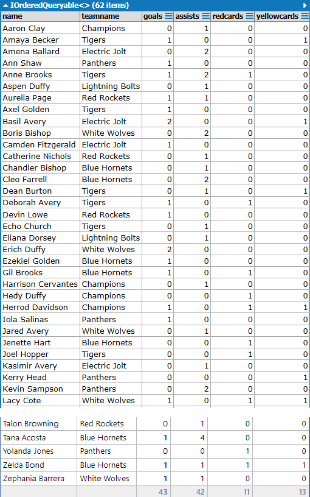
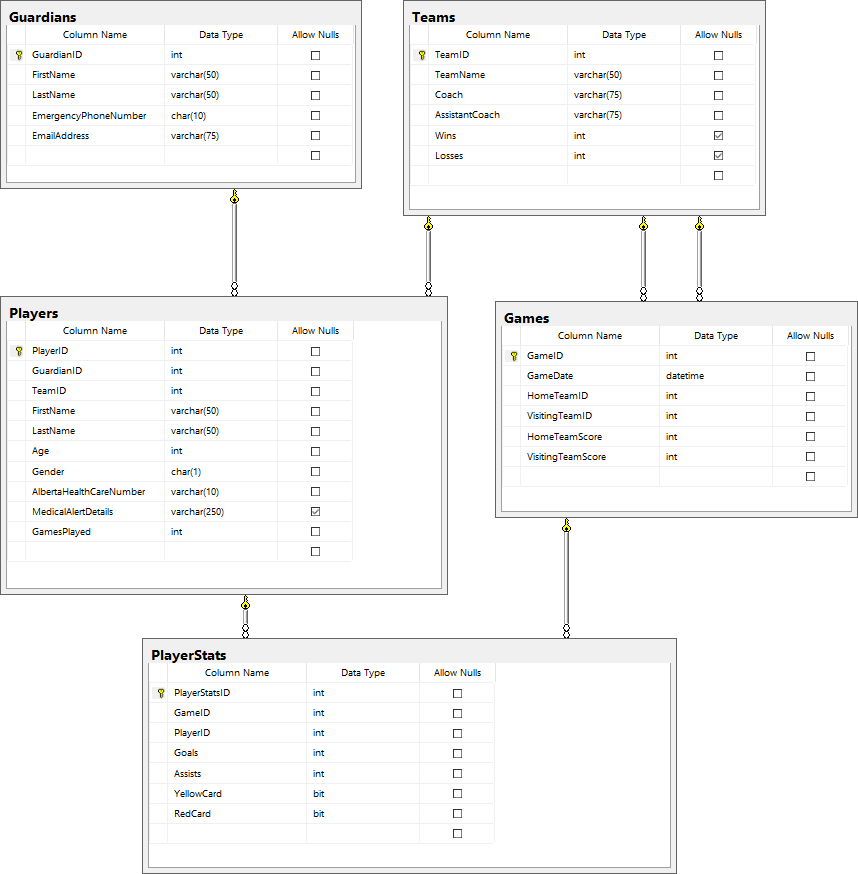

# In-Class Assessment - LINQ

**Your Name:** Reonel Duque 

> Place your name in the lines above. Work on the lab computer, not your laptop or personal computer.

## Marking Summary

| Earned | Item Weight | Evaluation Item | Comments/Concerns |
| ------ | ----------- | --------------- | ----------------- |
|    | 4 | Question 1 |   |
|    | 2 | Question 2 |   |
|    | 3 | Question 3 |   |
|    | 3 | Question 4 |   |
|    | 4 | Question 5 |   |
|    | -3 max | Penalities (insufficent commits, file submission, etc.) |   |
| -- | ------ | ------------------------------------------------------- |   |
|    | 16 | Total |    |

### Marking Rubric

| Weight | Breakdown |
| ----   | --------- |
| **2** | 2 = Proficient (requirement is met) 1 = Limited (requirement is poorly met, minor errors) 0 = Incomplete (requirement not met, missing large portions) |
| **3** | 3 = Proficient (requirement is met) 2 = Capable (requirement is adequately met, minor errors) 1 = Limited (requirement is poorly met, major errors) 0 = Incomplete (requirement not met, missing large portions) |
| **4** | 4 = **Proficient** (requirement is met) 3 = **Capable** (requirement is adequately met, minor errors) 2 = **Acceptable** (requirement is partially met, minor errors) 1 = **Limited** (requirement is poorly met, major errors) 0 = **Incomplete** (requirement not met, missing large portions) |

----

## Database

The physical database can be installed from the `.bak` file or the `.bacpac` file included in the starter kit.

## About FSIS

> **Fort Sasquatch Indoor Soccer** is a community soccer league.

## Queries

In this assessment, you are required to implement simple Linq queries. Place each answer in a single LinqPad Query. Please uncomment all of your code so that your instructor can run it without having to edit the file.   Your instructor will inform you on how and where to submit your files (all queries in one file). You **must** commit to each question as you complete it.

Your instructor will supply the database so that you can test your answers. You will need to restore the back-up to your machine. The ERD of the database is attached to the end of this document.

You may have access to your computer, MS SQL and LinqPad. You may access to your notes and samples.

The supplied images for each question, indicate the needed data to be reported and what your results should look like.

1. List all the Guardians with more than one child in the league. Sort the output by the number of guardian children, guardians with the most children first. Sort the listed children by Age. 
2. Display the number of male and female players in the league. 
3. List the teams and all their players. Sort the teams by name, and the players by last name, then first name. Use the strings Female and Male for the gender. 
4. List all the top teams with the most games won. 
5. List the players' stats (goals, assists). Include the player's full name (as one property), as well as their team name. Order by the full player name. 
   

