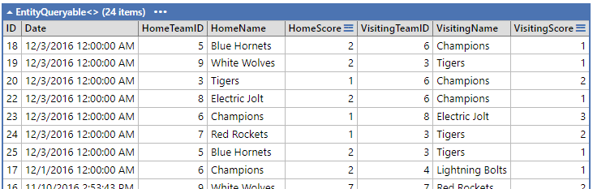
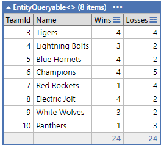
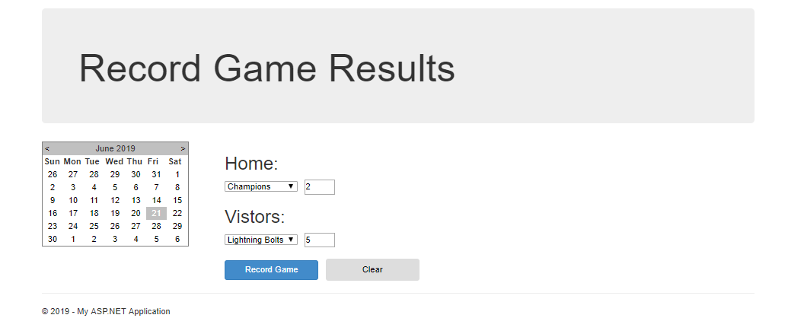
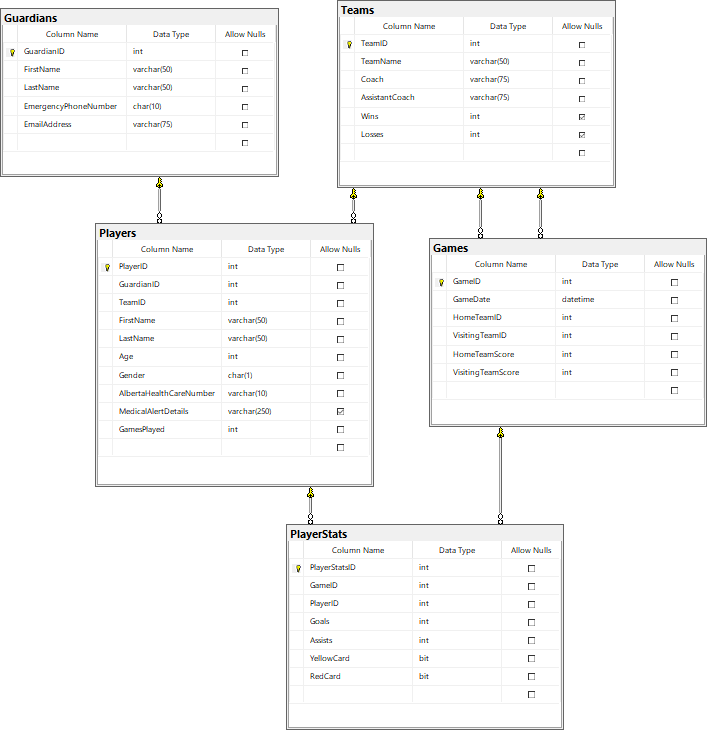

# In-Class Assessment - FSIS OLTP - 

> Transaction Processing -
> **Read the entire instructions before beginning your work**

Student Name: Reonel Duque

> Place your name in the line above.

## Marking Summary

| Evaluation Item  | Weight | **Mark** | Comments |
|-------------------------------|:------:|:--------:|:--------:|
| Create Query: Display the game records in descending  order      | 2      | **TBD** |   |
| Create Query: Display the team records for teams.    | 2  | **TBD** |   |
| Create driver test sequence (within try{ }): display team records, process game record, display team records and game records              | 2      | **TBD** |   |
| Transaction method: Game_RecordGame - 2 teams, non-tie, game does not exists validation tests and messages. All messages possible are returned.                 | 4      | **TBD** |   |
| Transaction method: Game_RecordGame - create game record                                              | 2      | **TBD** |   |
| Transaction method: Game_RecordGame - update Team records correctly                                   | 3      | **TBD** |   |
| **Penalty** - transaction service method: Game_RecordGame processing **NOT** done within a single transaction | -4 Max    | **TBD** |   |
| Total                                                                                                      | *15*   | **TBD** |   |

### Marking Rubric

| Weight | Breakdown |
| ----- | --------- |
| **1** | 1 = **Proficient** (requirement is met)<br />0 = **Incomplete** (requirement not met, missing large portions) |
| **2** | 2 = **Proficient** (requirement is met)<br />1 = **Limited** (requirement is poorly met, minor errors)<br />0 = **Incomplete** (requirement not met, missing large portions) |
| **3** | 3 = **Proficient** (requirement is met)<br />2 = **Capable** (requirement is adequately met, minor errors)<br />1 = **Limited** (requirement is poorly met, major errors)<br />0 = **Incomplete** (requirement not met, missing large portions) |


----

## Database

The physical database can be installed from the `.bacpac` file included in the starter kit.

## About FSIS

> **Fort Sasquatch Indoor Soccer** is a community soccer league.

## Requirements

## All work is to be done in a program environment Linqpad file

In this assessment, you will be demonstrating your understanding of OTLP using Entity Framework. In this assessment, you will be evaluated on the following:

- creating a testing environment in Linqpad.
- Implement a method processing multiple records within a Transaction.
- Implement logical validation within the transactional method.

 The repository contains the database in a `.bacpac` file called **FSIS_2018.bacpac**. Copy the code block below into a LINQPad. Set the startup as **C# - Program.**  **This code works and should not be altered.**
 
 ```csharp
void Main()
{
	try
	{
		//YOUR CODE HERE
		
		//Driver
		//display teams method
		
		//create instance of GameStat with test data
		
		//call Game_RecordGame(xxxxx)
		
		//display teams method
		
		//display games method
		
	}
	catch (ArgumentNullException ex)
	{
		GetInnerException(ex).Message.Dump();
	}
	catch (ArgumentException ex)
	{

		GetInnerException(ex).Message.Dump();
	}
	catch (AggregateException ex)
	{
		//having collected a number of errors
		//	each error should be dumped to a separate line
		foreach (var error in ex.InnerExceptions)
		{
			error.Message.Dump();
		}
	}
	catch (Exception ex)
	{
		GetInnerException(ex).Message.Dump();
	}
}

// You can define other methods, fields, classes and namespaces here

private Exception GetInnerException(Exception ex)
{
	while (ex.InnerException != null)
		ex = ex.InnerException;
	return ex;
}

public class GameStat
{
	public DateTime GameDate {get;set;}
	public int HomeTeamId {get;set;}
	public int HomeTeamScore {get;set;}
	public int VisitingTeamId {get;set;}
	public int VisitingTeamScore {get;set;}
}

public void Game_RecordGame(GameStat game)
{
	//local variables
	Teams teamexists = null;
	Games gameexists = null;
	

	//we need a container to hold x number of Exception messages
	List<Exception> errorlist = new List<Exception>();
	
	//YOUR CODE HERE
	
}

public void DisplayTeams()
{
	//YOUR CODE HERE		
}

public void DisplayGames()
{
	//YOUR CODE HERE
}
```

You are to complete each of the activities to create a successful solution to this assessment. You will need to use specified names in portions of the activities to integrate with the existing code. You many need to create local variables to use in your answer (these variables can be called whatever you wish). Use the following activity instructions to complete this assessment.

### Use Regular Commits

Commit your work at the end of every **Activity**. Ensure you sync your local clone to the classroom on GitHub before the end of class. The classroom access ends at
the end of class. **It is your responsibility that your work is properly submitted. Failure to submit your work will result is a mark of 0 (zero).**

### Setup

Restore the supplied SQL database by importing it as a Data-Tier Application. The database name is **FSIS_2018**. The database contains data for testing your solution. **You will have to create the EF connection string to use your sql server.** Run the solution. 


### Activity 1 - Create queries to display data

Create two queries to be used to view data on the data base. These queries will be used by the driver routine to display the results of your transaction.

#### DisplayGames

This query will display the games records. Display the teamname beside the team id. Order the games in descending game date.



#### DisplayTeams

This query will display the team records.



### Activity 2 - Create a driver routine to execute your transaction service method.

Place your driver code within the supplied `try { }` of `Main`. The code should 

- display the team records prior to executing the transaction.
- create an instance of the command model `GameStat` containing your test data.
- call the transaction service method `Game_RecordGame(GameStat item)`
- display the team records after executing the transaction.
- display the game records after executing the transaction.

Pass the data instance into the method `Game_RecordGame(GameStat item)` for processing. The GameStat command model has been coded. Processing must be contained in user friendly error handling. Display an appropriate message if the player stats were successfully processed.

### Command Model: GameStat

``` csharp
public class GameStat
{
    public DateTime GameDate {get; set;}
    public int HomeTeamId {get; set;}
    public int HomeTeamScore {get; set;}
    public int VisitingTeamId {get; set;}
    public int VisitingTeamScore {get; set;}
}
```

### Activity 3 - Implement transactional service method `Game_RecordGame(GameStat item)`

The transaction service method will insert a new game record and update the existing team Wins/Losses stats. The following web page form would be supplying the data to this method.



Within your method, verify the following, ensuring that appropriate messages are supplied with your exception. Collect all possible errors.

- Team IDs must be different (a team cannot play against itself)
- Team IDs must exist (no invalid team id)
- The score is **not** tied (elimination rules)
- Game date cannot be a future date
- The database does not currently have game information between these two teams for the supplied game date (previous record exists). Test is: Date, HomeTeam and VisitingTeam is an exact match. *Example:* September 15, 2022, homeTeam 5, VisitingTeam 3 **IS** equal to September 15, 2022, HomeTeam 5, VisitingTeam 3 **BUT NOT** equal to September 15, 2022, HomeTeam 3, VisitingTeam 5.

To process the game, you will need to create a new game record, and update the Wins and Losses of the teams appropriately. Process this request within a **single transaction**.

# FSIS ERD




